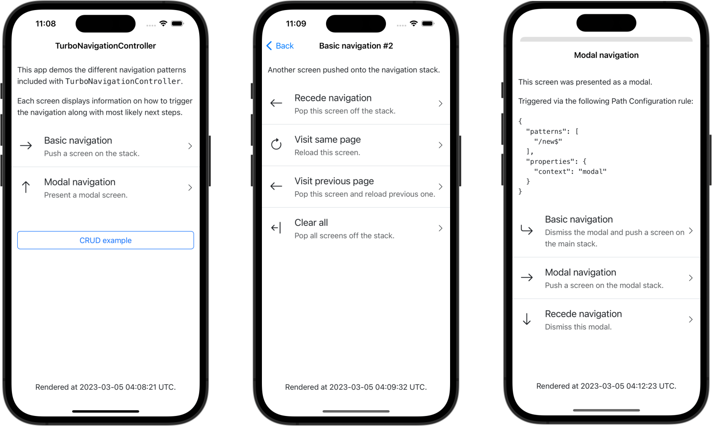
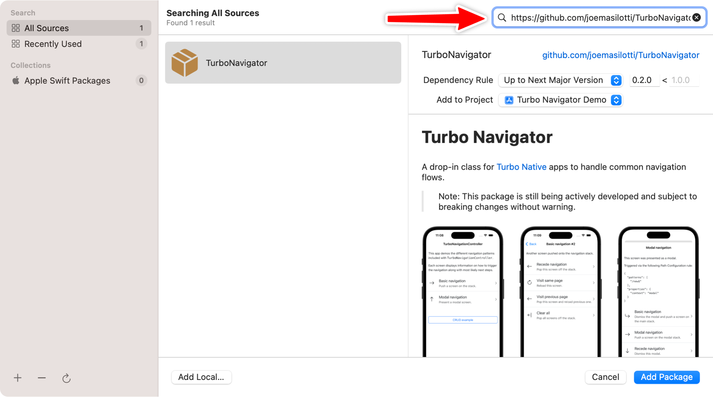

# Turbo Navigator

A drop-in class for [Turbo Native](https://github.com/hotwired/turbo-ios) apps to handle common navigation flows.

> Note: This package is still being actively developed and subject to breaking changes without warning.



## Why use this?

Turbo Native apps require a fair amount of navigation handling to create a decent experience.

Unfortunately, not much of this is built into turbo-ios. A lot of boilerplate is required to have anything more than basic pushing/popping of screens.

This package abstracts that boilerplate into a single class. You can drop it into your app and not worry about handling every flow manually.

I've been using something a version of this on the [dozens of Turbo Native apps](https://masilotti.com/services/) I've built over the years.

## Handled flows

When a link is tapped, turbo-ios sends a `VisitProposal` to your application code. Based on the [Path Configuration](https://github.com/hotwired/turbo-ios/blob/main/Docs/PathConfiguration.md), different `PathProperties` will be set.

* **Current context** - What state the app is in.
    * `modal` - a modal is currently presented
    * `default` - otherwise
* **Given context** - Value of `context` on the requested link.
    * `modal` or `default`/blank
* **Given presentation** - Value of `presentation` on the proposal.
    * `replace`, `pop`, `refresh`, `clear_all`, `replace_root`, `none`, `default`/blank
* **Navigation** - The behavior that the navigation controller provides.

<table>
  <thead>
    <tr>
      <th>Current Context</th>
      <th>Given Context</th>
      <th>Given Presentation</th>
      <th>New Presentation</th>
    </tr>
  </thead>
  <tbody>
    <tr>
      <td><code>default</code></td>
      <td><code>default</code></td>
      <td><code>default</code></td>
      <td>Push on main stack (or)<br>
        Replace if visiting same page (or)<br>
        Pop (and visit) if previous controller is same URL
      </td>
    </tr>
    <tr>
      <td><code>default</code></td>
      <td><code>default</code></td>
      <td><code>replace</code></td>
      <td>Replace controller on main stack</td>
    </tr>
    <tr>
      <td><code>default</code></td>
      <td><code>modal</code></td>
      <td><code>default</code></td>
      <td>Present a modal with only this controller</td>
    </tr>
    <tr>
      <td><code>default</code></td>
      <td><code>modal</code></td>
      <td><code>replace</code></td>
      <td>Present a modal with only this controller</td>
    </tr>
    <tr>
      <td><code>modal</code></td>
      <td><code>default</code></td>
      <td><code>default</code></td>
      <td>Dismiss then Push on main stack</td>
    </tr>
    <tr>
      <td><code>modal</code></td>
      <td><code>default</code></td>
      <td><code>replace</code></td>
      <td>Dismiss then Replace on main stack</td>
    </tr>
    <tr>
      <td><code>modal</code></td>
      <td><code>modal</code></td>
      <td><code>default</code></td>
      <td>Push on the modal stack</td>
    </tr>
    <tr>
      <td><code>modal</code> </td>
      <td><code>modal</code></td>
      <td><code>replace</code></td>
      <td>Replace controller on modal stack</td>
    </tr>
    <tr>
      <td><code>default</code></td>
      <td>(any)</td>
      <td><code>pop</code></td>
      <td>Pop controller off main stack</td>
    </tr>
    <tr>
      <td><code>default</code></td>
      <td>(any)</td>
      <td><code>refresh</code></td>
      <td>Pop on main stack then</td>
    </tr>
    <tr>
      <td><code>modal</code></td>
      <td>(any)</td>
      <td><code>pop</code></td>
      <td>Pop controller off modal stack (or)<br>
        Dismiss if one modal controller
      </td>
    </tr>
    <tr>
      <td><code>modal</code></td>
      <td>(any)</td>
      <td><code>refresh</code></td>
      <td>Pop controller off modal stack then<br>
        Refresh last controller on modal stack<br>
        (or)<br>
        Dismiss if one modal controller then<br>
        Refresh last controller on main stack
      </td>
    </tr>
    <tr>
      <td>(any)</td>
      <td>(any)</td>
      <td><code>clearAll</code></td>
      <td>Dismiss if modal controller then<br>
        Pop to root then<br>
        Refresh root controller on main stack
      </td>
    </tr>
    <tr>
      <td>(any)</td>
      <td>(any)</td>
      <td><code>replaceRoot</code></td>
      <td>Dismiss if modal controller then<br>
        Pop to root then<br>
        Replace root controller on main stack
      </td>
    </tr>
    <tr>
      <td>(any)</td>
      <td>(any)</td>
      <td><code>none</code></td>
      <td>Nothing</td>
    </tr>
  </tbody>
</table>

### Examples

To present forms (URLs ending in `/new` or `/edit`) as a modal, add the following to the `rules` key of your Path Configuration.

```json
{
  "patterns": [
    "/new$",
    "/edit$"
  ],
  "properties": {
    "context": "modal"
  }
}
```

To hook into the "refresh" [turbo-rails native route](https://github.com/hotwired/turbo-rails/blob/main/app/controllers/turbo/native/navigation.rb), add the following to the `rules` key of your Path Configuration. You can then call `refresh_or_redirect_to` in your controller to handle Turbo Native and web-based navigation.

```json
{
  "patterns": [
    "/refresh_historical_location"
  ],
  "properties": {
    "presentation": "refresh"
  }
}
```

## Getting started

First, create a new Xcode project using the iOS App template.


Then add the Turbo Navigator Swift package.

1. In Xcode, File → Add Packages…
1. Enter the following URL in the upper right: `https://github.com/joemasilotti/TurboNavigator`
1. Click Add Package
1. Click Add Package again



Replace `SceneDelegate.swift` with the following.

```swift
import TurboNavigator
import UIKit

let rootURL = URL(string: "http://localhost:3000")!

class SceneDelegate: UIResponder, UIWindowSceneDelegate {
    var window: UIWindow?

    private let navigationController = UINavigationController()
    private lazy var navigator = TurboNavigator(delegate: self, navigationController: navigationController)

    func scene(_ scene: UIScene, willConnectTo session: UISceneSession, options connectionOptions: UIScene.ConnectionOptions) {
        window?.rootViewController = navigationController
        navigator.route(rootURL)
    }
}

extension SceneDelegate: TurboNavigationDelegate {}
```

Start the [demo Rails server](Demo/Server) then run the iOS app in Xcode via Product → Run.

## Demo project

The `Demo/` directory includes an iOS app and Ruby on Rails server to demo the package.

It shows off most of the navigation flows outlined above. There is also an example CRUD resource for more real world applications of each.

## Custom controller and routing overrides

You can also implement an optional method on the `TurboNavigationDelegate` to handle custom routing.

This is useful to break out of the default behavior and/or render a native screen. You may inspect the provided proposal and decide routing based on any of its properties. For custom native screens, you may also include a "view-controller" property that will be passed along.

```json
{
  "patterns": [
    "/numbers$"
  ],
  "properties": {
    "view-controller": "numbers"
  }
}
```

```swift
class MyCustomClass: TurboNavigationDelegate {
    let navigator = TurboNavigator(delegate: self)

    func handle(proposal: VisitProposal) -> ProposalResult {
        if proposal.url.path == "/numbers" || proposal.viewController == "numbers" {
            // Let Turbo Navigator route this custom controller.
            return NumbersViewController()
        } else if proposal.presentation == .clearAll {
            // Return nil to tell Turbo Navigator stop processing the request.
            return nil
        } else {
            // Return the given controller to continue with default behavior.
            // Optionally customize the given controller.
            controller.view.backgroundColor = .orange
            return controller
        }
    }
}
```

If you're relying on the "view-controller" property, we recommend your view controllers conform to `PathConfigurationIdentifiable`. You should also avoid using the class name as identifier, as that may change over time.

```swift
class NumbersViewController: UIViewController, PathConfigurationIdentifiable {
    static var pathConfigurationIdentifier: String { "numbers" }
}

class MyCustomClass: TurboNavigationDelegate {
    let navigator = TurboNavigator(delegate: self)
    
    func handle(proposal: VisitProposal) -> ProposalResult {
        if proposal.url.path == "/numbers" || proposal.viewController == NumbersViewController.pathConfigurationIdentifier {
            // Let Turbo Navigator route this custom controller.
            return NumbersViewController()
        } else ... 
            ...
        }
    }
}
``` 

## Custom configuration

Customize the configuration via `TurboConfig`.

### Override the user agent

Keep "Turbo Native" to use `turbo_native_app?` on your Rails server.

```swift
TurboConfig.shared.userAgent = "Custom (Turbo Native)"
```

### Customize the web view and web view configuration

A closure is used because a new instance is needed for each web view. The closure has a `WKWebViewConfiguration` argument that's pre-built and ready to be customized and assigned to a new web view.

```swift
TurboConfig.shared.makeCustomWebView = { (configuration: WKWebViewConfiguration) in
    // Customize the WKWebViewConfiguration instance
    // ...

    return WKWebView(frame: .zero, configuration: configuration)
}
```

### Customize behavior for external URLs

Turbo cannot navigate across domains because page visits are done via JavaScript. A clicked link that points to a different domain is considered external.

By default, a `SFSafariViewController` is presented. This can be overridden by implementing the following delegate method.

```swift
class MyCustomClass: TurboNavigationDelegate {
    func openExternalURL(_ url: URL, from controller: UIViewController) {
        // Do something custom with the external URL.
        // The controller is provided to present on top of.
    }
}
```

### Customized error handling

By default, Turbo Navigator will automatically handle any errors that occur when performing visits. The error's localized description and a button to retry the request is displayed.

You can customize the error handling by overriding the following delegate method.

```swift
extension MyCustomClass: TurboNavigationDelegate {
    func visitableDidFailRequest(_ visitable: Visitable, error: Error, retry: @escaping RetryBlock) {
        if case let TurboError.http(statusCode) = error, statusCode == 401 {
            // Custom error handling for 401 responses.
        } else if let errorPresenter = visitable as? ErrorPresenter {
            errorPresenter.presentError(error) {
                retry()
            }
        }
    }
}
```
